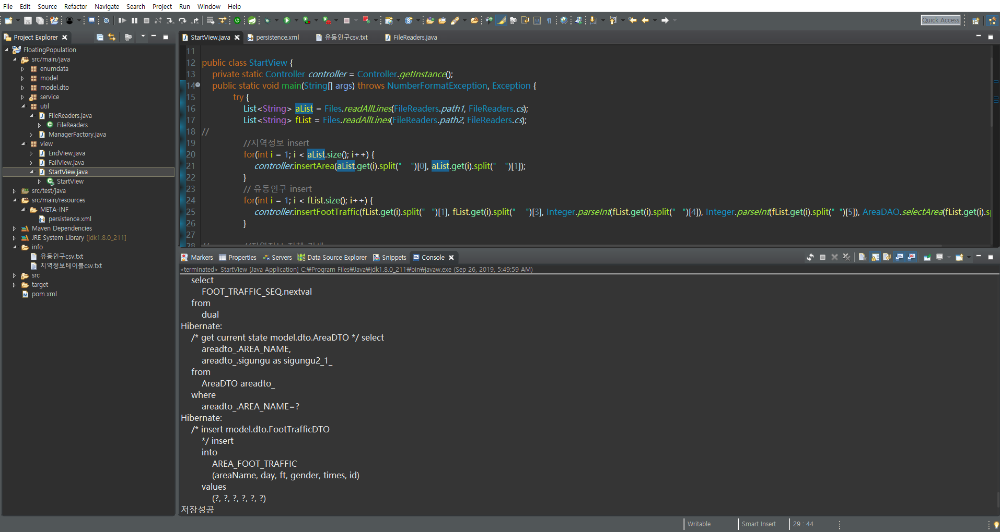
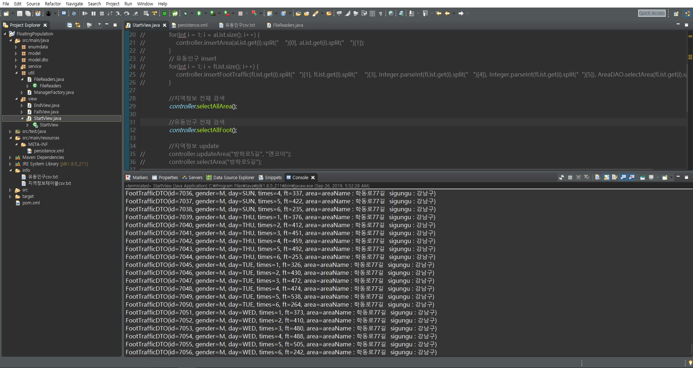
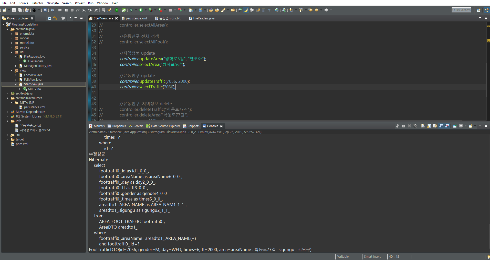
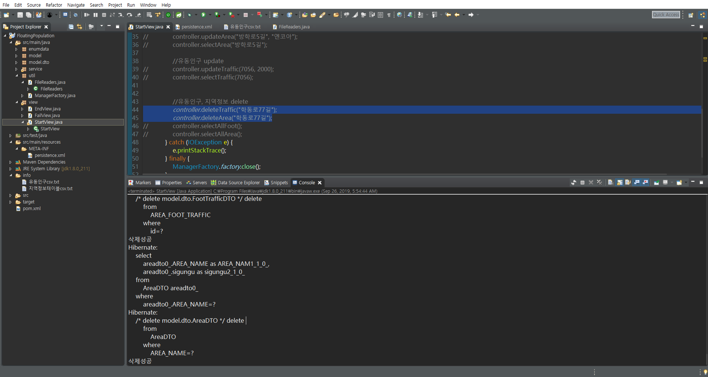

# Project Name
# [Floating-Population](https://github.com/angle2v/Floating-Population)

# Team Members

### Sookyung Kim [GitHub](https://github.com/sooish)
### Minwoong Kang [GitHub](https://github.com/happymwkang)
### Woongtae Kim [GitHub](https://github.com/angle2v)
### Sunggook Choi [GitHub](https://github.com/SunggookCHOI)
### Jongsung Kim [GitHub](https://github.com/SEJSCloud)

# Programming Language
### - [Java]

# API
### - [JPA]
# DB
### - [OracleRDBMS]
# Why use jpa
#### - Object-oriented data management allows you to focus on business logic and object-oriented development
#### - Easy to create, alter, and manage tables
#### - Rather than focusing logic on queries, we can focus on the object itself
#### - Rapid development is possible

# Content
### - Development of miniproject logic using java-jpa by receiving regional floating population data from

# DB reference
### [Seoul Open Data Plaza](https://data.seoul.go.kr/)
# Preview project

